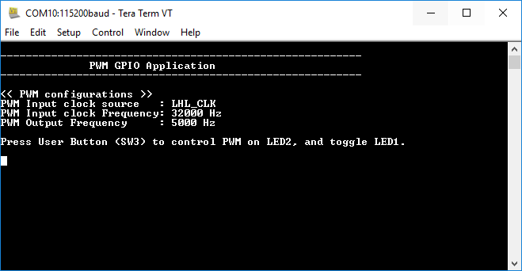

# PWM GPIO

This code example demonstrates the configuration of pulse width modulation (PWM) to control the brightness of an LED, and configuration of GPIO to toggle an LED ON and OFF using the Eclipse IDE for ModusToolbox&trade; software. This application also demonstrates how to invert the PWM signals which would be helpful for applications such as motor speed and direction control.

[View this README on GitHub.](https://github.com/Infineon/mtb-example-btsdk-pwm-gpio)

[Provide feedback on this code example.](https://cypress.co1.qualtrics.com/jfe/form/SV_1NTns53sK2yiljn?Q_EED=eyJVbmlxdWUgRG9jIElkIjoiQ0UyMjg5MzgiLCJTcGVjIE51bWJlciI6IjAwMi0yODkzOCIsIkRvYyBUaXRsZSI6IlBXTSBHUElPIiwicmlkIjoiZHJhaiIsIkRvYyB2ZXJzaW9uIjoiMi4xLjAiLCJEb2MgTGFuZ3VhZ2UiOiJFbmdsaXNoIiwiRG9jIERpdmlzaW9uIjoiTUNEIiwiRG9jIEJVIjoiSUNXIiwiRG9jIEZhbWlseSI6IkJUQUJMRSJ9)

## Requirements

- [ModusToolbox&trade; software](https://www.cypress.com/products/modustoolbox-software-environment) v2.4.

- Board support package (BSP) minimum required version: 3.0.0
- Programming language: C
- Associated parts: 
  - [AIROC™ CYW20819 Bluetooth® & Bluetooth® LE system-on-chip](https://www.cypress.com/datasheet/CYW20819)
  - [AIROC™ CYW20820 Bluetooth® & Bluetooth® LE system-on-chip](https://www.infineon.com/dgdl/Infineon-CYW20820_Ultra_Low_Power_Bluetooth_LE_BR_EDR_Bluetooth_5.0_SoC-AdditionalTechnicalInformation-v06_00-EN.pdf?fileId=8ac78c8c7d0d8da4017d0ee7e70770d1&utm_source=cypress&utm_medium=referral&utm_campaign=202110_globe_en_all_integration-datasheet)
  - [AIROC™ CYW20719 Bluetooth® & Bluetooth® LE system-on-chip](https://www.cypress.com/documentation/datasheets/cyw20719-enhanced-low-power-bredrble-bluetooth-50-soc)
  - [AIROC™ CYW20735 Bluetooth® & Bluetooth® LE system-on-chip](https://www.cypress.com/documentation/datasheets/cyw20735b1-single-chip-bluetooth-transceiver-wireless-input-devices)
  - [AIROC™ CYW20835 Bluetooth® & Bluetooth® LE system-on-chip](https://www.infineon.com/dgdl/Infineon-AIROC_CYW20835_Bluetooth_LE_System-on-chip-AdditionalTechnicalInformation-v01_00-EN.pdf?fileId=8ac78c8c7d718a49017d945f48bd4c3b)

## Supported toolchains (make variable 'TOOLCHAIN')

- GNU Arm® embedded compiler v10.3.1 (`GCC_ARM`) - Default value of `TOOLCHAIN`

## Supported kits (make variable 'TARGET')

-  [CYW920820M2EVB-01 evaluation kit](https://www.infineon.com/cms/en/product/wireless-connectivity/airoc-bluetooth-le-bluetooth-multiprotocol/cyw20820/) (`CYW920820M2EVB-01`) – Default value of `TARGET`
-  [CYW920835M2EVB-01 evaluation kit](https://www.infineon.com/cms/en/product/wireless-connectivity/airoc-bluetooth-le-bluetooth-multiprotocol/cyw20835/) (`CYW920835M2EVB-01`)
-  [CYW920719B2Q40EVB-01 evaluation kit](https://www.cypress.com/documentation/development-kitsboards/cyw920719b2q40evb-01-evaluation-kit) (`CYW920719B2Q40EVB-01`)
-  [CYW920735Q60EVB-01 evaluation kit](https://www.cypress.com/CYW920735Q60EVB-01) (`CYW920735Q60EVB-01`)
-  [CYW920819EVB-02 evaluation kit](https://www.cypress.com/CYW920819EVB-02) (`CYW920819EVB-02`)
-  [CYW920820EVB-02 evaluation kit](https://www.cypress.com/CYW920820EVB-02) (`CYW920820EVB-02`)

## Hardware setup

This example uses the board's default configuration. See the kit user guide to ensure that the board is configured correctly.


## Software setup

Install a terminal emulator if you don't have one. Instructions in this document use [Tera Term](https://ttssh2.osdn.jp/index.html.en).

This example requires no additional software or tools.


## Using the code example

Create the project and open it using one of the following:

<details><summary><b>In Eclipse IDE for ModusToolbox&trade; software</b></summary>

1. Click the **New Application** link in the **Quick Panel** (or, use **File** > **New** > **ModusToolbox&trade; Application**). This launches the [Project Creator](https://www.cypress.com/ModusToolboxProjectCreator) tool.

2. Pick a kit supported by the code example from the list shown in the **Project Creator - Choose Board Support Package (BSP)** dialog.

   When you select a supported kit, the example is reconfigured automatically to work with the kit. To work with a different supported kit later, use the [Library Manager](https://www.cypress.com/ModusToolboxLibraryManager) to choose the BSP for the supported kit. You can use the Library Manager to select or update the BSP and firmware libraries used in this application. To access the Library Manager, click the link from the **Quick Panel**.

   You can also just start the application creation process again and select a different kit.

   If you want to use the application for a kit not listed here, you may need to update the source files. If the kit does not have the required resources, the application may not work.

3. In the **Project Creator - Select Application** dialog, choose the example by enabling the checkbox.

4. (Optional) Change the suggested **New Application Name**.

5. The **Application(s) Root Path** defaults to the Eclipse workspace which is usually the desired location for the application. If you want to store the application in a different location, you can change the *Application(s) Root Path* value. Applications that share libraries should be in the same root path.

6. Click **Create** to complete the application creation process.

For more details, see the [Eclipse IDE for ModusToolbox&trade; software user guide](https://www.cypress.com/MTBEclipseIDEUserGuide) (locally available at *{ModusToolbox&trade; software install directory}/ide_{version}/docs/mt_ide_user_guide.pdf*).

</details>

<details><summary><b>In command-line interface (CLI)</b></summary>

ModusToolbox&trade; software provides the Project Creator as both a GUI tool and the command line tool, "project-creator-cli". The CLI tool can be used to create applications from a CLI terminal or from within batch files or shell scripts. This tool is available in the *{ModusToolbox&trade; software install directory}/tools_{version}/project-creator/* directory.

Use a CLI terminal to invoke the "project-creator-cli" tool. On Windows, use the command line "modus-shell" program provided in the ModusToolbox&trade; software installation instead of a standard Windows command-line application. This shell provides access to all ModusToolbox&trade; software tools. You can access it by typing `modus-shell` in the search box in the Windows menu. In Linux and macOS, you can use any terminal application.

This tool has the following arguments:

Argument | Description | Required/optional
---------|-------------|-----------
`--board-id` | Defined in the `<id>` field of the [BSP](https://github.com/Infineon?q=bsp-manifest&type=&language=&sort=) manifest | Required
`--app-id`   | Defined in the `<id>` field of the [CE](https://github.com/Infineon?q=ce-manifest&type=&language=&sort=) manifest | Required
`--target-dir`| Specify the directory in which the application is to be created if you prefer not to use the default current working directory | Optional
`--user-app-name`| Specify the name of the application if you prefer to have a name other than the example's default name | Optional

<br>

The following example will clone the "[PWM GPIO](https://github.com/Infineon/mtb-example-btsdk-pwm-gpio)" application with the desired name "PwmGpio" configured for the *CYW920819EVB-02* BSP into the specified working directory, *C:/mtb_projects*:

   ```
   project-creator-cli --board-id CYW920819EVB-02 --app-id mtb-example-btsdk-pwm-gpio --user-app-name PwmGpio --target-dir "C:/mtb_projects"
   ```

**Note:** The project-creator-cli tool uses the `git clone` and `make getlibs` commands to fetch the repository and import the required libraries. For details, see the "Project creator tools" section of the [ModusToolbox&trade; software user guide](https://www.cypress.com/ModusToolboxUserGuide) (locally available at *{ModusToolbox&trade; software install directory}/docs_{version}/mtb_user_guide.pdf*).

</details>

<details><summary><b>In third-party IDEs</b></summary>

Use one of the following options:

- **Use the standalone [Project Creator](https://www.cypress.com/ModusToolboxProjectCreator) tool:**

   1. Launch Project Creator from the Windows Start menu or from *{ModusToolbox&trade; software install directory}/tools_{version}/project-creator/project-creator.exe*.

   2. In the initial **Choose Board Support Package** screen, select the BSP, and click **Next**.

   3. In the **Select Application** screen, select the appropriate IDE from the **Target IDE** drop-down menu.

   4. Click **Create** and follow the instructions printed in the bottom pane to import or open the exported project in the respective IDE.

<br>

- **Use command-line interface (CLI):**

   1. Follow the instructions from the **In command-line interface (CLI)** section to create the application, and then import the libraries using the `make getlibs` command.

   2. Export the application to a supported IDE using the `make <ide>` command.

   3. Follow the instructions displayed in the terminal to create or import the application as an IDE project.

For a list of supported IDEs and more details, see the "Exporting to IDEs" section of the [ModusToolbox&trade; software user guide](https://www.cypress.com/ModusToolboxUserGuide) (locally available at *{ModusToolbox&trade; software install directory}/docs_{version}/mtb_user_guide.pdf*).

</details>


## Operation

###	Using two Bluetooth&reg; SoC boards:

1. Connect the two boards to your PC using the provided USB cable through the USB connector.

2. Open a terminal program and select the **WICED PUART COM** port. Set the serial port parameters to 8N1 and 115200 baud. You need two windows of the terminal application to view messages from the GATT Server device and the GATT Client device.

3. Program one board with the 'PWM GPIO' application.

   <details><summary><b>Using Eclipse IDE for ModusToolbox&trade; software</b></summary>

      1. Select the application project in the Project Explorer.

      2. In the **Quick Panel**, scroll down, and click **\<Application Name> Program (KitProg3_MiniProg4)**.
   </details>

   <details><summary><b>Using CLI</b></summary>

     From the terminal, execute the `make program` command to build and program the application using the default toolchain to the default target. The default toolchain and target are specified in the application's Makefile but you can override those values manually:
      ```
      make program TARGET=<BSP> TOOLCHAIN=<toolchain>
      ```

      Example:
      ```
      make program TARGET=CYW920819EVB-02 TOOLCHAIN=GCC_ARM
      ```
    </details>

4. After programming, the application boots up automatically. Initially the PWM duty cycle is configured as 0, and LED1 is ON. The device trace on the PUART will show basic configurations of the PWM.

    **Figure 1. PUART terminal output after booting up**

    

5. Press the user button (SW3) to vary the PWM duty cycle between 0% and 100%. When SW3 is pressed initially, the PWM duty cycle on LED2, pin D6, and pin D7 will start changing. This results in the brightness change in a ramping fashion on LED2. In addition, LED1 toggles from ON to OFF.

6. Press the user button SW3 again. LED2 will hold its brightness level at which the button was pressed. LED1 toggles from OFF to ON. The UART terminal shows the duty cycle at which the PWM is stopped. Pin D6 and D7 will also hold the same duty cycle.

    **Note:** The PWM output on D6 and D7 will be inverted with respect to each other.

    **Figure 2. PUART terminal output**

    


## Debugging

You can debug the example to step through the code. In the IDE, use the **PWM_GPIO Debug_JLink** configuration in the **Quick Panel**. For more details, see the "Program and debug" section in the Eclipse IDE for ModusToolbox&trade; software user guide: *{ModusToolbox&trade; software install directory}/ide_{version}/docs/mt_ide_user_guide.pdf*.


## Design and implementation

The PWM GPIO application demonstrates how PWMs and GPIOs can be configured in an application using Eclipse IDE for ModusToolbox&trade; software. It also shows how the PWM signal and GPIO toggling are controlled using an on-board button. When the device is powered ON, it boots up, initializes the PUART, and initializes the Bluetooth&reg; stack. The Bluetooth&reg; stack callback function (`bt_cback`) does the device configuration; configures the GPIO, registers interrupts, and starts a thread to control the PWM signal.

The `application_start()` function is the entry point to this application. It initializes the PUART and routes all debug traces to the PUART. By default, the PUART baud rate is configured as 115,200 bps. You can change this by using the `wiced_hal_puart_configuration()` function. The `application_start` function also initializes the Bluetooth&reg; stack (`wiced_bt_stack_init()`).  The Bluetooth&reg; stack callback function (`bt_cback()`) performs the following operations when it detects the `BTM_ENABLED_EVT` event:

1. Configures GPIOs (pins D6 and D7) and LED2 for PWM output.

2. Configures LED1 and sets its output to '0' by default. (**Note:** Pins are active LOW.)

3. Configures the on-board button (SW3) and the register for button interrupt.

4. Creates a thread to control the PWM signal.

Whenever SW3 is pressed and released, the application detects a button interrupt and calls the interrupt callback function (`button_cb()`). The app toggles values of LED1 and the PWM flag. The button is configured to detect the falling edge of the interrupt signal (for example, `GPIO_EN_INT_FALLING_EDGE`). If the PWM flag is TRUE, the duty cycle of the PWM signal will start changing between 0% to 100% back and forth in the `PWM_control` thread function. This continuous change in the PWM signal will create a ramping effect on the LED2 brightness. The `duty_cycle` is incremented or decremented with a step size which is set in the application (`DUTY_STEP_SIZE`).

When the PWM flag is FALSE, LED2 will hold its brightness level at which the button was pressed; LED1 toggles from OFF to ON.

The PWM output on pins D6 and D7 are set inverted with respect to each other as shown in [Figure 3](#figure-3-inverted-pwm-in-pins-D6-and-D7).

**Figure 3. Inverted PWM in pins D6 and D7**


This inverted PWM is achieved by setting the initial states of pins D6 and D7 as follows, and configuring them for the PWM signal:

```c
wiced_hal_gpio_configure_pin(CYBSP_D6, GPIO_OUTPUT_ENABLE, GPIO_PIN_OUTPUT_HIGH);
wiced_hal_gpio_configure_pin(CYBSP_D7, GPIO_OUTPUT_ENABLE, GPIO_PIN_OUTPUT_LOW);
```
The initial states (immediately after programming) of LED1, LED2, and pin D6 and D7 are as follows:

**Table 1. Initial states of LEDs and pins**

|Pin    |State          |
|-------|---------------|
|LED1   |ON             |
|LED2   |OFF            |
|pin D6 |LOGIC_HIGH     |
|pin D7 |LOGIC_LOW      |

**Note:** The initial value of `pwm_flag` is 0.

This application also provides an option to use the auxiliary clock for generating a PWM signal which uses the 24-MHz base frequency. Note that the desired GPIO pin must have already been configured to output for `aclk`. See *wiced_hal_aclk.h* for more details.

To enable the auxiliary clock, set `ENABLE_PMU_CLK` to TRUE in *pwm_gpio.c*.

```c
#if ENABLE_PMU_CLK
    clk=PMU_CLK;
    wiced_hal_aclk_enable(PWM_INP_CLK_IN_HZ, WICED_ACLK1, WICED_ACLK_FREQ_24_MHZ);
#endif
```

**Note:** By default, `ENABLE_PMU_CLK` is set to FALSE and the app uses `LHL_CLK`.

## Resources and settings

This section explains the ModusToolbox&trade; software resources and their configuration as used in this code example. Note that all the configuration explained in this section has already been done in the code example. Eclipse IDE for ModusToolbox&trade; software stores the configuration settings of the application in the *design.modus* file. This file is used by the graphical configurators, which generate the configuration firmware. This firmware is stored in the application’s *GeneratedSource* folder.

- **Device configurator:** Used for enabling/configuring the peripherals and pins used in the application. See the
[Device configurator guide](https://www.cypress.com/ModusToolboxDeviceConfig).

- **Bluetooth&reg; configurator:** Used for generating/modifying the Bluetooth&reg; LE GATT database. See the
[Bluetooth&reg; configurator guide](https://www.cypress.com/ModusToolboxBLEConfig).

## Related resources

Resources  | Links
-----------| ----------------------------------
Application notes| [AN225684](https://www.cypress.com/an225684) – Getting started with CYW208xx
Code examples | Visit the [Cypress GitHub repo](https://www.cypress.com/mtb-github) for a comprehensive collection of code examples using Eclipse IDE for ModusToolbox&trade; software|
Device documentation | [CYW20819 device datasheet](https://www.cypress.com/datasheet/CYW20819) <br> [CYW20820 device datasheet](https://www.cypress.com/datasheet/CYW20820) <br> [CYW20719 device datasheet](https://www.cypress.com/documentation/datasheets/cyw20719-enhanced-low-power-bredrble-bluetooth-50-soc) <br> [CYW20735 device datasheet](https://www.cypress.com/documentation/datasheets/cyw20735b1-single-chip-bluetooth-transceiver-wireless-input-devices)
Development kits| [CYW920819EVB-02 evaluation kit](https://www.cypress.com/CYW920819EVB-02) <br> [CYW920820EVB-02 evaluation kit](https://www.cypress.com/CYW920820EVB-02) <br> [CYW920719B2Q40EVB-01 evaluation kit](https://community.cypress.com/docs/DOC-17736) <br> [CYW920735Q60EVB-01 evaluation kit](https://www.cypress.com/CYW920735Q60EVB-01)
Tools  | [Eclipse IDE for ModusToolbox&trade; software](https://www.cypress.com/modustoolbox) – ModusToolbox&trade; software is a collection of easy-to-use software and tools enabling rapid development with Infineon MCUs, covering applications from embedded sense and control to wireless and cloud-connected systems using AIROC&trade; Wi-Fi and Bluetooth® connectivity devices.

<br>

## Other resources


Cypress provides a wealth of data at www.cypress.com to help you select the right device, and quickly and effectively integrate it into your design.

## Document history

Document title: *CE228938* - *PWM GPIO*

  Version  | Description of change
  -------  | ---------------------
  1.0.0    | New code example
  1.1.0    | Updated to support ModusToolbox&trade; software v2.1
  2.0.0    | Major update to support ModusToolbox&trade; software v2.2. <br> This version is not backward compatible with ModusToolbox&trade; software v2.1
  2.0.1    | Minor documentation updates
  2.1.0    | Added support for CYW920820 and CYW920835

<br>

---------------------------------------------------------

© Cypress Semiconductor Corporation, 2020-2022. This document is the property of Cypress Semiconductor Corporation, an Infineon Technologies company, and its affiliates ("Cypress").  This document, including any software or firmware included or referenced in this document ("Software"), is owned by Cypress under the intellectual property laws and treaties of the United States and other countries worldwide.  Cypress reserves all rights under such laws and treaties and does not, except as specifically stated in this paragraph, grant any license under its patents, copyrights, trademarks, or other intellectual property rights.  If the Software is not accompanied by a license agreement and you do not otherwise have a written agreement with Cypress governing the use of the Software, then Cypress hereby grants you a personal, non-exclusive, nontransferable license (without the right to sublicense) (1) under its copyright rights in the Software (a) for Software provided in source code form, to modify and reproduce the Software solely for use with Cypress hardware products, only internally within your organization, and (b) to distribute the Software in binary code form externally to end users (either directly or indirectly through resellers and distributors), solely for use on Cypress hardware product units, and (2) under those claims of Cypress’s patents that are infringed by the Software (as provided by Cypress, unmodified) to make, use, distribute, and import the Software solely for use with Cypress hardware products.  Any other use, reproduction, modification, translation, or compilation of the Software is prohibited.
<br>
TO THE EXTENT PERMITTED BY APPLICABLE LAW, CYPRESS MAKES NO WARRANTY OF ANY KIND, EXPRESS OR IMPLIED, WITH REGARD TO THIS DOCUMENT OR ANY SOFTWARE OR ACCOMPANYING HARDWARE, INCLUDING, BUT NOT LIMITED TO, THE IMPLIED WARRANTIES OF MERCHANTABILITY AND FITNESS FOR A PARTICULAR PURPOSE.  No computing device can be absolutely secure.  Therefore, despite security measures implemented in Cypress hardware or software products, Cypress shall have no liability arising out of any security breach, such as unauthorized access to or use of a Cypress product. CYPRESS DOES NOT REPRESENT, WARRANT, OR GUARANTEE THAT CYPRESS PRODUCTS, OR SYSTEMS CREATED USING CYPRESS PRODUCTS, WILL BE FREE FROM CORRUPTION, ATTACK, VIRUSES, INTERFERENCE, HACKING, DATA LOSS OR THEFT, OR OTHER SECURITY INTRUSION (collectively, "Security Breach").  Cypress disclaims any liability relating to any Security Breach, and you shall and hereby do release Cypress from any claim, damage, or other liability arising from any Security Breach.  In addition, the products described in these materials may contain design defects or errors known as errata which may cause the product to deviate from published specifications. To the extent permitted by applicable law, Cypress reserves the right to make changes to this document without further notice. Cypress does not assume any liability arising out of the application or use of any product or circuit described in this document. Any information provided in this document, including any sample design information or programming code, is provided only for reference purposes.  It is the responsibility of the user of this document to properly design, program, and test the functionality and safety of any application made of this information and any resulting product.  "High-Risk Device" means any device or system whose failure could cause personal injury, death, or property damage.  Examples of High-Risk Devices are weapons, nuclear installations, surgical implants, and other medical devices.  "Critical Component" means any component of a High-Risk Device whose failure to perform can be reasonably expected to cause, directly or indirectly, the failure of the High-Risk Device, or to affect its safety or effectiveness.  Cypress is not liable, in whole or in part, and you shall and hereby do release Cypress from any claim, damage, or other liability arising from any use of a Cypress product as a Critical Component in a High-Risk Device. You shall indemnify and hold Cypress, including its affiliates, and its directors, officers, employees, agents, distributors, and assigns harmless from and against all claims, costs, damages, and expenses, arising out of any claim, including claims for product liability, personal injury or death, or property damage arising from any use of a Cypress product as a Critical Component in a High-Risk Device. Cypress products are not intended or authorized for use as a Critical Component in any High-Risk Device except to the limited extent that (i) Cypress’s published data sheet for the product explicitly states Cypress has qualified the product for use in a specific High-Risk Device, or (ii) Cypress has given you advance written authorization to use the product as a Critical Component in the specific High-Risk Device and you have signed a separate indemnification agreement.
<br>
Cypress, the Cypress logo, and combinations thereof, WICED, ModusToolbox, PSoC, CapSense, EZ-USB, F-RAM, and Traveo are trademarks or registered trademarks of Cypress or a subsidiary of Cypress in the United States or in other countries. For a more complete list of Cypress trademarks, visit cypress.com. Other names and brands may be claimed as property of their respective owners.
