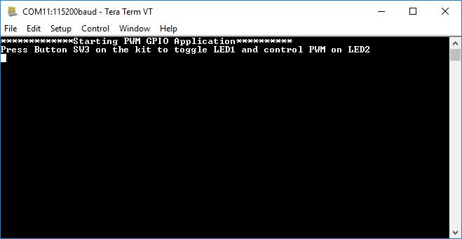
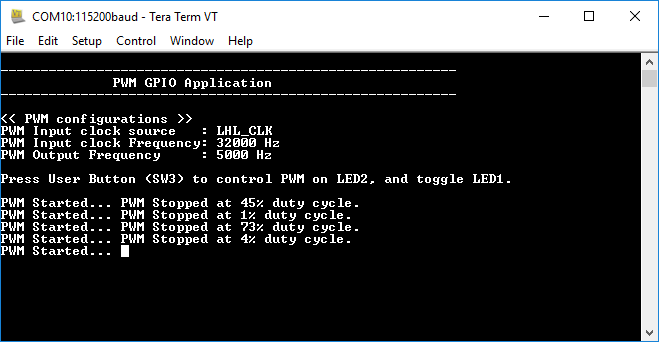

# Test Plan PWM GPIO

|Test Case ID| Steps      | Expected result|
|------------|------------|----------------|
|1           | **Basic Test**: Build and Program test: Build the project and program the kit.| The project builds and programs successfully.|
|2           | **Basic Test**: *UART TEST* - After executing test#1, connect the kit to a PC and open terminal at 115200 baud. Press the reset button on kit.| Terminal displays the following prints:|
|3           | **Basic Test**: *INITIAL CONDITIONS* - Check initial states of LED1, LED2, pin D6, pin D7 after programming the application|LED1 (GPIO) should be in ON state. LED2 (PWM) should be in OFF state. pin D6 should be in LOGIC_HIGH state and pin D7 should be in LOGIC_LOW state|
|4           | **Basic Test**: *INITIALIZE PWM* - Press Application button (SW3) and check states of LED 1, LED 2, pin D6 and pin D7 levels|PWM duty cycle on LED2, pin D6 and pin D7 will start changing. PWM output on D7 and D6 will be inverted with respect to each other. Also LED 1 will toggled from ON to OFF |
|5           | **Basic Test**: *STOP PWM* - After #4 test, press application button (SW3) to stop the PWM change and observe the output of LED 1, LED 2, pin D6, pin D7 states. Also check the Terminal prints|LED2 will holds it brightness level at which the button was pressed and LED 1 will be toggeded from OFF to ON. The terminal will print the brightness at which LED 1 is stopped when button is pressed|
|6               |**Basic Test** :*RESTART PWM* - After #5 test, press application button (SW3) to restart the PWM. Similarly stop and restart PWM at different moments and check whteher the duty_cycle prints in accordance with output PWM signal. (LED 2, pin D6, D7 signals)|PWM duty cycle on LED2, pin D6 and pin D7 will start changing. And LED1 will get toggled from ON to OFF when PWM restarts. Terminal displays the following prints:  |
|7               |**Basic Test** :*USE PMU_CLK* - Set ENABLE_PMU_CLK to TRUE in `pwm_gpio.c` and check whether the program works as expected or not. (Set PWM_INP_CLK_IN_HZ to 24\*1000000 and select PWM_FREQ_IN_HZ more than 16\*1000 for testing)|Select PWM_FREQ_IN_HZ more than 16\*1000 and the LED2, pin D6 and pin D7 should change the PWM as expected with output frequency 16\*1000|
|8               |**Basic Test** :*CHANGE PWM FREQ* - Change the PWM_FREQ_IN_HZ from 1000 to 16\*1000 and check whether the PWM signal comes out as expected frequency or not|PWM signal should be in the frequency set in PWM_FREQ_IN_HZ and the duty cyce should oscillate between 0 to 100|

> **Note:** Basic test category meant for quick sanity test of the example with any updated dependency assets. Advance tests are to cover the complete example functionality when the implementation/design gets changed.

Test cases were executed using HEX files generated using the following combinations:

**IDE flow**: refers to testing by creating the project using the ModusToolbox IDE’s New project wizard, followed by programming using the Quick launch setting. See the Readme’s Using the Code Example -> In ModusToolbox IDE section for steps.

**CLI flow**: refers to testing by creating the project by downloading or cloning the project repo and building and programming from the CLI. See the Readme’s Operation -> Using ModusToolbox IDE section for details.

**TOOLCHAIN** = Toolchain used for building the application (GCC_ARM)

**TARGET** = Supported kit target (See Readme for supported kits:)
  * CYW920819EVB-02
  * CYW920820EVB-02
  * CYW920719B2Q40EVB-01
  * CYW920735Q60EVB-01
